# Customer Support Ticket Resolution - Process Flow Diagram

```mermaid
flowchart TD
    START([Customer submits support request via email]) --> S1[Step 1: Ticket Receipt<br/>Read email data]
    
    S1 --> S2[Step 2: Customer Lookup<br/>Search CRM system]
    
    S2 --> S3[Step 3: Ticket Classification<br/>Categorize issue type]
    
    S3 --> S4{Step 4: Priority Assessment<br/>Determine priority level}
    
    S4 -->|VIP Customer| S5_HIGH[Step 5: Initial Response<br/>Send acknowledgment - High Priority]
    S4 -->|Regular Customer| S5_NORMAL[Step 5: Initial Response<br/>Send acknowledgment - Normal Priority]
    
    S5_HIGH --> S6
    S5_NORMAL --> S6[Step 6: Issue Analysis<br/>Review against knowledge base]
    
    S6 --> S7{Step 7: Resolution Decision<br/>Auto-resolve or escalate?}
    
    S7 -->|Auto-resolvable| S8[Step 8: Generate Resolution Response<br/>Create solution content]
    S7 -->|Requires escalation| S12[Step 12: Assign to Human Agent<br/>Route to appropriate agent]
    S7 -->|Refund over $500| S12
    
    S8 --> S9[Step 9: Update Customer Record<br/>Record resolution details]
    S9 --> S10[Step 10: Send Resolution Email<br/>Deliver solution to customer]
    S10 --> S11[Step 11: Mark Ticket Resolved<br/>Update ticket status]
    
    S12 --> S13[Step 13: Send Internal Notification<br/>Notify agent via Slack]
    S13 --> S14[Step 14: Update Ticket Status to Escalated<br/>Track escalation]
    S14 --> S15[Step 15: Human Agent Takes Over<br/>Manual resolution]
    
    S11 --> S16[Step 16: Follow-up Email<br/>Check satisfaction after 48hrs]
    S15 --> S16
    
    S16 --> S16_DECISION{Customer Response?}
    S16_DECISION -->|Satisfaction < 3| S17[Step 17: Manager Review<br/>Escalate to management]
    S16_DECISION -->|Satisfaction >= 3| S18[Step 18: Close Ticket<br/>Archive and finalize]
    S16_DECISION -->|No response after 7 days| S18
    
    S17 --> S18
    S18 --> END([Process Complete])

    %% Styling
    classDef triggerStyle fill:#e1f5fe,stroke:#01579b,stroke-width:2px
    classDef integrationStyle fill:#f3e5f5,stroke:#4a148c,stroke-width:2px
    classDef promptStyle fill:#e8f5e8,stroke:#1b5e20,stroke-width:2px
    classDef decisionStyle fill:#fff3e0,stroke:#e65100,stroke-width:2px
    classDef endStyle fill:#ffebee,stroke:#b71c1c,stroke-width:2px
    
    class START,END triggerStyle
    class S1,S2,S5_HIGH,S5_NORMAL,S9,S10,S11,S12,S13,S14,S15,S16,S17,S18 integrationStyle
    class S3,S6,S8 promptStyle
    class S4,S7,S16_DECISION decisionStyle
```

## Process Legend

### Node Types
- **🔵 Trigger/End Nodes**: Process start and completion points
- **🟣 Integration Actions**: System interactions (CRM, Email, Ticketing, Slack)
- **🟢 Prompt Actions**: AI-powered analysis and content generation
- **🟠 Decision Points**: Branching logic based on conditions

### Key Decision Points
1. **Priority Assessment (Step 4)**: VIP vs Regular customer routing
2. **Resolution Decision (Step 7)**: Auto-resolve vs Human escalation
3. **Follow-up Response (Step 16)**: Satisfaction-based closure or review

### Integration Systems
- **CRM (Salesforce)**: Customer lookup and record updates
- **Email (Gmail/Outlook)**: Customer communications
- **Ticketing (Zendesk)**: Ticket status management
- **Slack**: Internal agent notifications
- **Knowledge Base**: Policy and solution lookup

### Business Rules Applied
- VIP customers get priority handling (1-hour response)
- Refund requests over $500 auto-escalate to humans
- Satisfaction scores < 3/5 trigger manager review
- Auto-closure after 7 days without customer response